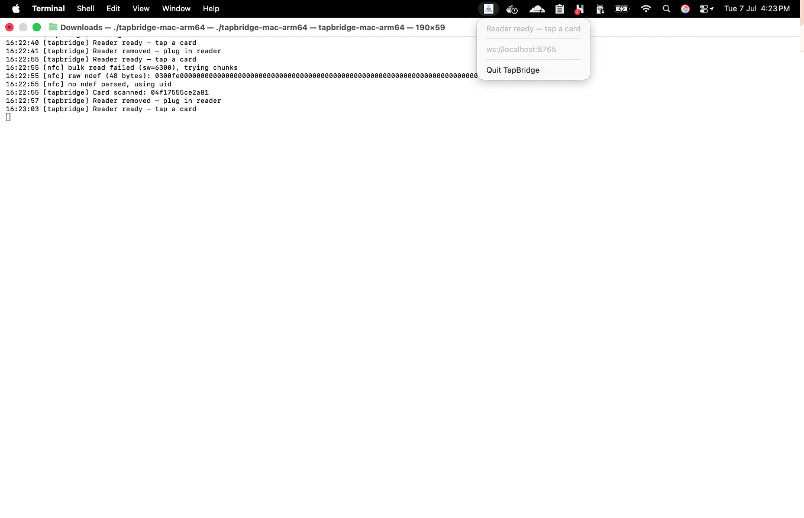
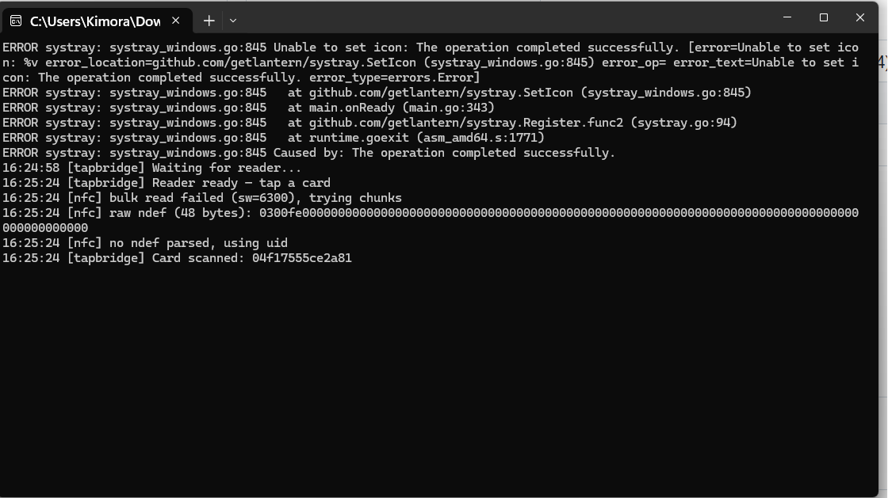

# TapBridge

[](https://github.com/felaris/tapbridge/actions/workflows/release.yml)
[](https://github.com/felaris/tapbridge/actions/workflows/test.yml)
[](https://github.com/felaris/tapbridge/releases/latest)
[](go.mod)
[](LICENSE)
[](#installation)

A lightweight, cross-platform system tray application that bridges a USB NFC card reader (e.g. **ACR122U**) to any browser-based web app over a local WebSocket connection.

It runs quietly in your menu bar / system tray, watches for NFC cards, and streams tapped card IDs straight into your web app — no browser extensions, no drivers to configure manually, no native messaging hacks.

| macOS | Windows |
|:---:|:---:|
|  |  |

## Contents

- [How it works](#how-it-works)
- [Features](#features)
- [Requirements](#requirements)
- [Installation](#installation)
- [Usage](#usage)
- [Configuration](#configuration)
- [WebSocket protocol](#websocket-protocol)
- [NDEF format](#ndef-format)
- [Project structure](#project-structure)
- [Development](#development)
- [License](#license)

## How it works

```
 ┌──────────────────┐       PC/SC       ┌───────────────────────┐      WebSocket      ┌──────────────┐
 │  NFC card /      │ ───────────────▶  │       TapBridge        │ ──────────────────▶ │  Browser /   │
 │  ACR122U reader  │                   │  (system tray app)     │ ws://localhost:8765 │  Web app     │
 └──────────────────┘                   └───────────────────────┘ ◀────────────────── └──────────────┘
                                                                       write requests
```

The bridge polls the connected PC/SC reader for card taps, reads the card's NDEF data (or falls back to its raw UID), and broadcasts the result to every connected WebSocket client. It can also write an ID back onto a blank/rewritable card on request from the browser.

## Features

- 🖥️ **System tray app** — runs in the background on macOS and Windows, no terminal window required
- 🔌 **PC/SC based** — works with any PC/SC-compatible reader implementing the standard contactless pseudo-APDU set (tested with the ACR122U)
- 🌐 **WebSocket bridge** — any web page can connect to `ws://localhost:8765` and receive card taps in real time
- 🔒 **Origin-restricted by default** — only `localhost`/`127.0.0.1` can connect out of the box; production domains must be explicitly allowlisted (see [Configuration](#configuration))
- 📖 **NDEF read support** — parses Text and URI NDEF records (with a `/verify/<id>` URL convention), falling back to the raw card UID when no NDEF data is present
- ✍️ **NDEF write support** — write a Text or URI record to a blank card on request from the browser
- 🗂️ **Multi-reader support** — pick which connected reader to use from the tray menu when more than one is plugged in
- 🚀 **Start at Login** — optional one-click toggle in the tray menu (macOS LaunchAgent / Windows Registry Run key)
- 🔁 **Resilient polling** — automatically recovers from reader disconnects/reconnects

## Requirements

- A PC/SC-compatible NFC reader (e.g. [ACR122U](https://www.acs.com.hk/en/products/3/acr122u-usb-nfc-reader/))
- macOS 11+ or Windows 10/11 (64-bit)
- PC/SC drivers for your reader (macOS has built-in PC/SC support via `pcscd`; Windows requires the manufacturer's driver)

> **Note:** TapBridge ships unsigned (no Apple Developer / Windows code-signing certificate). macOS Gatekeeper and Windows SmartScreen will warn on first run — see the install instructions below for how to get past that safely.

## Installation

### macOS — one-line install (Apple Silicon & Intel)

```bash
curl -fsSL https://github.com/felaris/tapbridge/releases/latest/download/install.sh | bash
```

This downloads the correct binary for your Mac, installs it to `~/.local/bin`, and clears the macOS quarantine flag automatically (no Apple Developer certificate needed).

Then run it:

```bash
tapbridge
```

Or double-click the binary in Finder.

### macOS — manual download

Grab `tapbridge-mac-arm64` (Apple Silicon) or `tapbridge-mac-intel` (Intel) from the [latest release](https://github.com/felaris/tapbridge/releases/latest), then clear the quarantine flag before running it:

```bash
xattr -d com.apple.quarantine ~/Downloads/tapbridge-mac-arm64
chmod +x ~/Downloads/tapbridge-mac-arm64
./tapbridge-mac-arm64
```

### Windows

Download `tapbridge-windows.exe` from the [latest release](https://github.com/felaris/tapbridge/releases/latest) and run it. Windows SmartScreen may warn about an unsigned binary — choose **More info → Run anyway**.

### Building from source

See [Development](#development).

## Usage

1. Plug in your NFC reader (e.g. ACR122U).
2. Launch `tapbridge` — a tray icon appears showing the current status.
3. From your web app (running on `localhost` by default — see [Configuration](#configuration) for other origins), open a WebSocket connection to `ws://localhost:8765`.
4. Tap a card — the bridge reads it and broadcasts the ID to every connected client.

The tray menu shows live status (`Waiting for reader...`, `Card scanned: <id>`, etc.), the last scanned ID, the WebSocket URL, a **Select Reader** submenu if multiple readers are connected, and a **Start at Login** toggle.

## Configuration

Settings are resolved in this order (later wins): built-in defaults → config file → environment variable → CLI flag.

| Setting | CLI flag | Environment variable | Default |
|---|---|---|---|
| Bind address | `--host` | `TAPBRIDGE_HOST` | `127.0.0.1` (loopback only) |
| WebSocket port | `--port` | `TAPBRIDGE_PORT` | `8765` |
| Allowed origins | `--allow-origin` (comma-separated) | `TAPBRIDGE_ALLOWED_ORIGINS` (comma-separated) | `http://localhost`, `https://localhost`, `http://127.0.0.1`, `https://127.0.0.1` |

```bash
# Allow a production domain to connect, on a custom port
tapbridge --port 9000 --allow-origin https://app.example.com
```

By default TapBridge binds to **loopback only** (`127.0.0.1`), so the WebSocket is not reachable from other machines on your network. The origin allowlist stops malicious *websites*, but non-browser clients can send any `Origin` header — binding to loopback is what keeps card data on the local machine. Only set `--host 0.0.0.0` (or a LAN IP) if you genuinely need remote access and understand that any device that can reach the port will be able to read scanned card IDs.

An allowlist entry with no port (e.g. `https://app.example.com`) matches that host on **any** port; `http://localhost` likewise matches any `localhost` port, which is convenient for dev servers. If you're serving your web app from anything other than `localhost`, you **must** add its origin — TapBridge no longer accepts connections from arbitrary websites by default.

Reader selection and the Start at Login preference (set via the tray menu) are persisted to a local config file:

- macOS: `~/Library/Application Support/tapbridge/config.json`
- Windows: `%AppData%\tapbridge\config.json`

## WebSocket protocol

All messages are JSON with a `type` field.

### Server → client

| `type` | Fields | Sent when |
|---|---|---|
| `ready` | — | A client connects |
| `card` | `id` | A card is tapped and read (NDEF-parsed ID, or raw UID as fallback) |
| `write_ok` | `id` | A requested write completed successfully |
| `write_error` | `message` | A write failed, or a write was already pending |

### Client → server

| `type` | Fields | Effect |
|---|---|---|
| `write` | `id`, `recordType` (optional: `"text"` \| `"uri"`, default `"text"`) | Requests that the next tapped card be written with the given ID |

**Example — listening for card taps:**

```js
const ws = new WebSocket("ws://localhost:8765");
ws.onmessage = (event) => {
  const msg = JSON.parse(event.data);
  if (msg.type === "card") {
    console.log("Card scanned:", msg.id);
  }
};
```

**Example — writing a Text record (default):**

```js
ws.send(JSON.stringify({ type: "write", id: "abc123" }));
// Next tapped card receives the write; listen for "write_ok" / "write_error"
```

**Example — writing a URI record** (e.g. to match the `/verify/<id>` read convention):

```js
ws.send(JSON.stringify({ type: "write", id: "https://example.com/verify/abc123", recordType: "uri" }));
```

## NDEF format

- **URI records** (`U`): if the decoded URL contains `/verify/<id>`, the segment after it is extracted and used as the ID. Writing a URI abbreviates the scheme using the standard NDEF URI prefix table (`http://`, `https://`, `http://www.`, `https://www.`) to save space.
- **Text records** (`T`): the raw text (after the language code) is used as-is, trimmed of whitespace.
- **No NDEF data / unrecognized format**: the card's raw UID (hex-encoded) is used instead.

All writes are wrapped in a standard TLV block, padded to a 4-byte page boundary, and written starting at page 4 — compatible with MIFARE Ultralight-family (NTAG21x) tags. MIFARE Classic and other sector-authenticated or ISO-DEP (Type 4) tags are not supported.

## Project structure

```
.
├── main.go                    # Entry point — wires config, tray, WebSocket server, and NFC polling together
├── config.go                  # Config loading/persistence, CLI flags, origin allowlist logic
├── ws.go                      # WebSocket server: message protocol, broadcast, origin check
├── nfc.go                     # PC/SC polling loop, reader selection, card read/write
├── ndef.go                    # NDEF Text/URI record parsing and encoding
├── tray.go                    # System tray menu: status, reader picker, Start at Login, last scanned ID
├── autostart_darwin.go        # macOS LaunchAgent-based "Start at Login" (build-tagged: darwin)
├── autostart_windows.go       # Windows Registry Run-key "Start at Login" (build-tagged: windows)
├── autostart_other.go         # No-op fallback for other platforms
├── icon_windows.go            # Embeds assets/icon.ico on Windows (LoadImageW needs a real .ico)
├── icon_other.go              # Embeds assets/icon.png on macOS/Linux
├── *_test.go                  # Unit tests for NDEF encode/decode and origin allowlist logic
├── go.mod / go.sum            # Go module definition
├── assets/
│   ├── icon.png                # Source tray icon (macOS/Linux; embedded at build time)
│   └── icon.ico                # Windows tray icon, generated from icon.png
├── scripts/
│   ├── install.sh              # macOS one-line installer (fetches latest release, clears quarantine)
│   └── gen_icon.go             # Regenerates assets/icon.ico from assets/icon.png
├── .github/
│   └── workflows/
│       └── release.yml         # CI: builds Mac (arm64/intel) + Windows binaries and publishes a GitHub release on every push to main
├── LICENSE
└── README.md
```

## Development

Requires Go 1.26+ and CGO enabled (the PC/SC bindings and system tray both use cgo on macOS).

```bash
git clone https://github.com/felaris/tapbridge.git
cd tapbridge
go build -o tapbridge .
./tapbridge
```

Run the test suite (pure-function coverage for NDEF encode/decode and the origin allowlist):

```bash
go test ./...
```

### Release process

Every push to `main` triggers [`.github/workflows/release.yml`](.github/workflows/release.yml), which:

1. Computes the next patch version from the latest GitHub release tag
2. Builds macOS (arm64 + Intel) and Windows binaries
3. Tags the commit and publishes a new GitHub release with all binaries plus `install.sh` attached

## License

[MIT](LICENSE)
